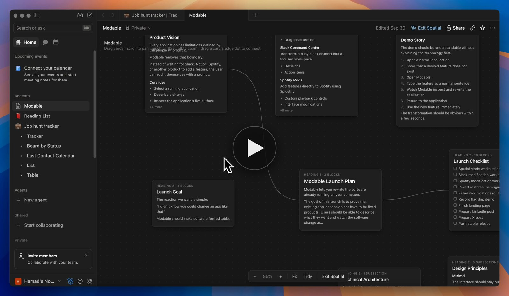

# Modable

**Every app has a ceiling. Modable lifts it.**

Modable is an AI agent that adds new features directly to the desktop apps already running on your computer.

[](https://github.com/hsultan-tech/modable/releases/download/launch-demo/modable-demo.mp4)

<sub>▶ Watch the demo (80 s, MP4)</sub>

## What it does

Pick an app, describe the feature you want in a sentence, and Modable writes it into the app's live window. These features ship with Modable and run against the real apps:

| Feature | App | Try asking |
| --- | --- | --- |
| **Spatial Mode** | Notion | "turn this page into a spatial canvas" |
| **Ghost Channels** | Discord | "make me a channel about AI agents" |
| **Conversation Map** | Discord | "untangle this channel" |
| **Discord → Notion Project** | Discord + Notion | "turn this into a Notion project" |
| **Command Center** | Slack | "turn this channel into a command center" |

- **Notion Spatial Mode** adds a Spatial control beside Share. It turns the current page into a canvas of draggable section cards with pan, zoom, fit and connections. Exit Spatial puts the page back untouched.
- **Discord Ghost Channels** adds a generated, local-only channel for a topic. It pulls the matching messages from across the server, each linked to the original. Nothing is posted to the server.
- **Discord Conversation Map** lays the loaded messages out as separate conversations, joined by their real replies. Every message links back to its place in the chat.
- **Discord → Notion Project** reads the channel or Ghost Channel on screen. It lays it out in Notion as a project with an overview, tasks, decisions, blockers, open questions and resources, each linked to its Discord message. Nothing is written to either app's data.
- **Slack Command Center** sorts a channel's loaded messages into decisions, action items, blockers and open questions, each linked to its message.

Anything else goes to the model. Prompts like "add a dark mode toggle", "add a floating clock to the header" or "count the words on screen" produce a new layer, written for the app's live UI on the spot.

## How it works

1. **Attach.** Modable starts the app with a Chrome DevTools Protocol debugging port, using a separate port per app (9222–9241). If the app is already running without one, Modable quits it and relaunches it.
2. **Inspect.** It reads the app's live interface: what's on screen and where things can be placed.
3. **Write.** Your request either matches one of the built-in features above or goes to the model (OpenAI, `gpt-4o` by default), which writes a layer for that interface.
4. **Inject and verify.** The layer is evaluated in the app's window. Modable then checks that every element the layer claims actually appeared. A layer that doesn't verify is reverted, never left half-applied.
5. **Revert.** Every layer can be removed from Modable.

For Electron apps, layers live in the running window. Modable doesn't modify the app's files on disk. Spotify isn't Electron, so it goes through [Spicetify](https://spicetify.app): Modable writes its own `modable-*.js` extensions next to yours and runs `spicetify apply`. It never touches your theme or your other extensions.

## Supported apps

| App | Status |
| --- | --- |
| Notion | Tested: Spatial Mode, Discord → Notion Project, generic prompts |
| Discord | Tested: Ghost Channels, Conversation Map, generic prompts |
| Slack | Tested: Command Center, generic prompts |
| Spotify | Via Spicetify. The App Store build can't be patched. |
| VS Code, Figma, Obsidian, WhatsApp, Telegram | Detected if installed. Generic prompts work only when the installed build is Electron. Not individually tested. |

Modable lists which installed apps it can reach. For any it can't, it says why.

## Getting started

### Prerequisites

- **macOS.** App discovery and session handling rely on `/Applications`, `lsof`, `sips` and `plutil`.
- **Node.js 18+** and npm
- **An OpenAI API key** ([get one](https://platform.openai.com/api-keys))
- The apps you want to modify, installed in `/Applications`
- For Spotify only: [Spicetify](https://spicetify.app/docs/getting-started)

### Run it

```bash
git clone https://github.com/hsultan-tech/modable.git
cd modable
npm install
npm run electron:dev
```

`electron:dev` opens the desktop app and starts the local backend (`server.js`, port 3456) for you.

On first launch, paste your OpenAI API key. It's stored in the app's local storage and sent only to OpenAI, through the local backend. You can change it later from the profile menu.

> If the window never appears and you see `Cannot read properties of undefined (reading 'whenReady')`, your shell has `ELECTRON_RUN_AS_NODE` set (VS Code terminals do this). Run `env -u ELECTRON_RUN_AS_NODE npm run electron:dev`.

To run the UI in a browser instead of Electron:

```bash
npm run server   # backend on http://localhost:3456
npm run dev      # UI on http://localhost:5173
```

## Development

```bash
npm test               # vitest, single run
npm run test:watch     # vitest, watch mode
npm run typecheck      # tsc --noEmit
npm run build          # web build into dist/
npm run electron:build # desktop build, packaged by electron-builder into release/
```

### Layout

```
electron/         Electron main process and preload
server.js         Local backend: app discovery, sessions, probe, inject, verify, revert, model proxy
lib/              Backend modules (sessions, verify, handoff, Spicetify adapter)
src/agent/        Request routing, built-in layers (src/agent/layers/), agent loop
src/components/   UI
test/             Vitest suites
```
